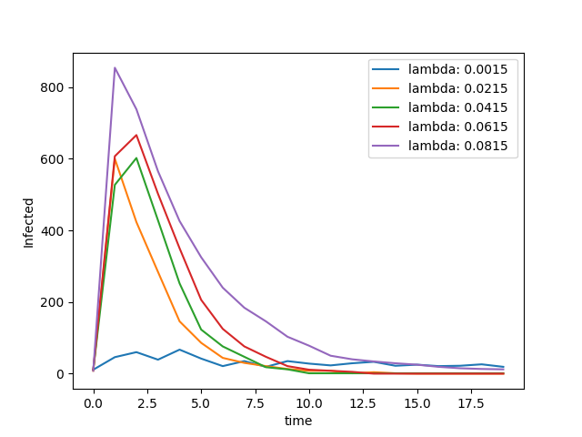
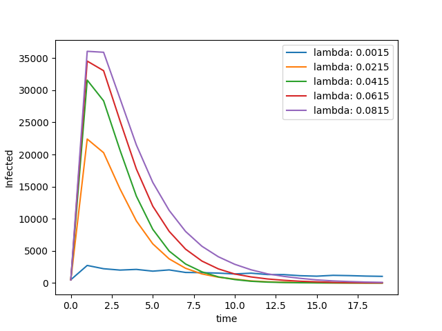
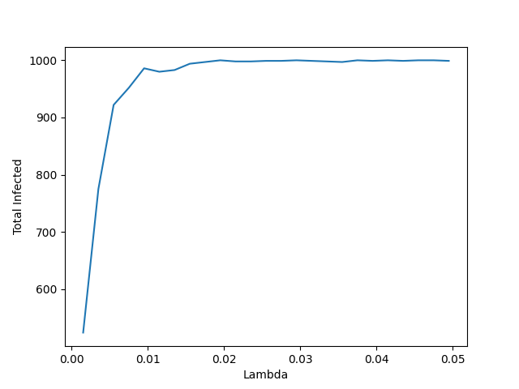
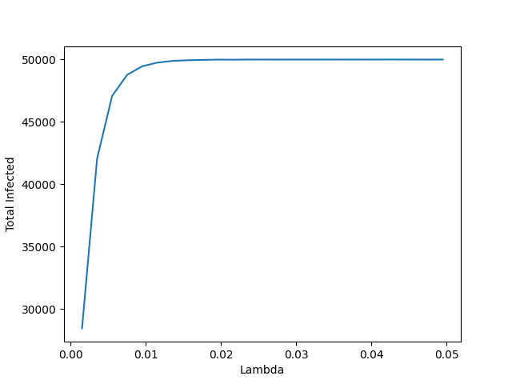

### Complex systems  

# 🦠 SIR simulator

## How to use

### :computer: Compilation

```
gfortran -o main.x main.f90
```

### :chart_with_downwards_trend: Usage

```
./main.x <filename> <initial_infected_rate> <lambda> <delta> <iterations>
```

- filename: name of the file containing pairs of connected nodes (string)
- initial infected rate: range 0-1 (float)
- lambda: infection parameter (float)
- delta: recovery parameter (float)
- iterations: total iterations to perform (integer)

### :snake: Usage with Python

Additionally, a python interface was developed to interact with the compiled Fortran code. In there, you can use the three existing functions `sir_over_time`, `lambda_dependency` and `recovery_dependency`.

The input arguments are attributes of an object of the classs `iInput`, which can be modified either on its definition or by setting individual values after the object creation.

The python script will compile and execute the Fortran code using the `os` library.

## 🧫 Results

#### SIR over time
 lambda = 0.0015, delta = 0.5, initial infected rate = 0.1 )

|            1.000 nodes net             |            50.000 nodes net             |
| :------------------------------------: | :-------------------------------------: |
|  |  |

#### Lambda dependency
( lambda = 0.0015 to 0.0815, delta = 0.5, initial infected rate = 0.1 )

|              1.000 nodes net               |              50.000 nodes net               |
| :----------------------------------------: | :-----------------------------------------: |
|  |  |

#### Recovery dependency
( lambda = 0.0015 to 0.0515, delta = 0.5, initial infected rate = 0.1 )

|               1.000 nodes net                |               50.000 nodes net                |
| :------------------------------------------: | :-------------------------------------------: |
|  |  |
